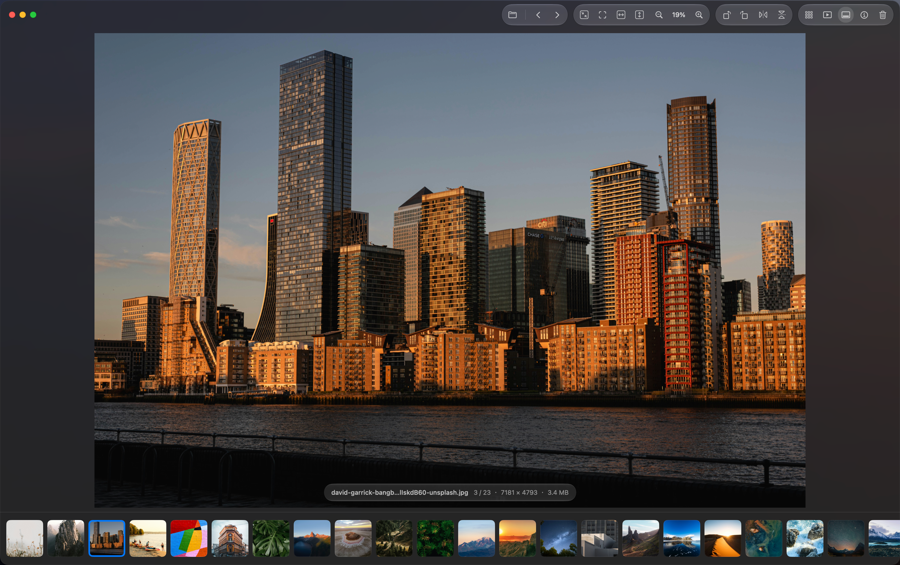
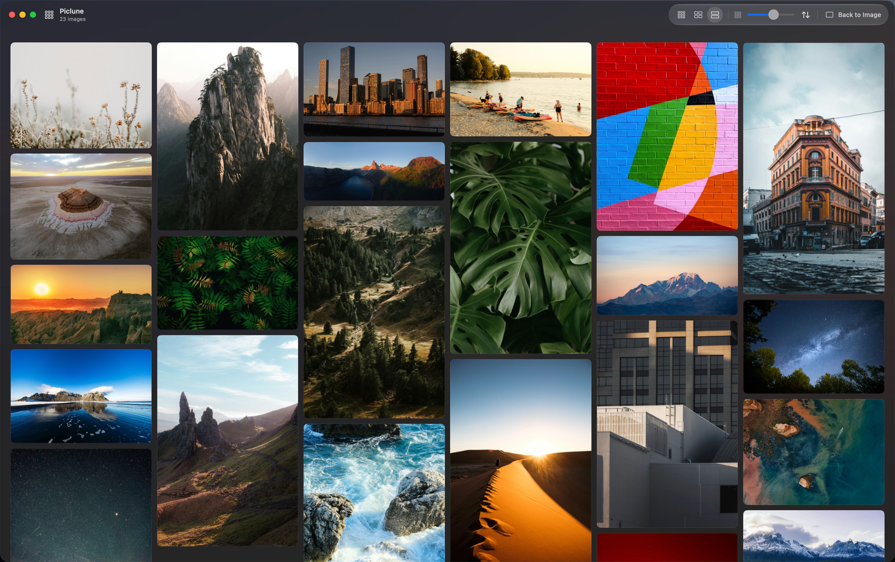
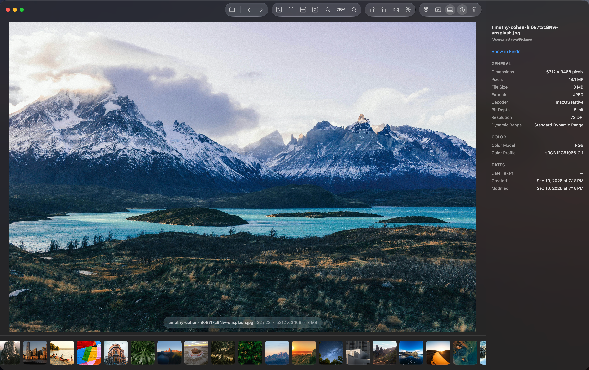

<h1 align="center">Piclune</h1>

打开一张图，浏览整个文件夹。

[English](README.md) · [隐私说明](PRIVACY.md) · [安装说明](INSTALL.md) · [已知限制](KNOWN-ISSUES.md)

Piclune 是一款免费的 Mac 原生看图器，为按文件夹管理图片的人而设计。从访达打开一张图片，即可浏览同目录内容，不需要导入图库。以克制的界面、连贯的动画与丰富的自定义选项，让看图更顺手。

**0.7.0 Public Beta 2 · 仅支持 Apple Silicon（M 系列）· macOS 15 或更新版本**

从本仓库的 **Releases** 下载 `Piclune-0.7.0-beta.2-arm64.zip`。不要下载 GitHub 自动生成的 “Source code” 压缩包来安装应用。

> 本测试版使用本地 ad-hoc 签名，**没有经过 Apple 公证**。首次启动可能被 macOS 阻止，请先阅读[安装说明](INSTALL.md)。这是公开测试版，并不代表所有系统、显示器与图片变体均已验证。

[下载 Apple Silicon 测试版](https://github.com/Nastasy4/Piclune/releases/tag/v0.7.0-beta.2)

## 顺手地浏览文件夹

- 从一张图片开始，用键盘、鼠标或触控板浏览同目录图片。
- 围绕指针缩放，适合窗口、宽度或高度，或查看实际大小。
- 缩略图栏可放在底部或左侧，可固定、边缘显示或隐藏。
- 文件夹总览支持方形、原始比例与瀑布流。
- 查看分辨率、文件信息及可用的 EXIF 元数据。
- 自选液态玻璃或传统样式、明暗外观及切换动画。
- 简体中文与英文；默认按系统语言偏好选择，也可在设置中修改。

液态玻璃需要 macOS 26 或更新版本，较旧系统自动使用原生材质。HDR 效果取决于图片和显示器；图片格式支持取决于当前系统的原生解码器。

## 一眼浏览整个文件夹

瀑布流总览保留图片比例，方便快速浏览和定位。

## 需要细节时，展开信息

在图片旁查看尺寸、格式、色彩信息与可用的元数据。

截图中的摄影图片来自 Unsplash，见[图片来源说明](SCREENSHOT-CREDITS.md)。

## 图片留在你的电脑上

Piclune 不上传图片、文件名或元数据。没有账户、广告、分析统计、云端处理和自动联网更新检查。仅使用本机原生图像解码，不调用第三方 Quick Look 缩略图扩展。剪贴板、云盘和系统服务的边界见[隐私说明](PRIVACY.md)。

## 免费使用

目前没有付费或捐赠入口。未来可能提供自愿支持渠道，不干扰正常看图。

本仓库初期用于安装包分发与问题反馈。免费发布不等于源码已采用开源许可证，见[分发说明](DISTRIBUTION.md)。

## 参与测试

可在 Issues 中提交问题与建议。请说明系统版本、Mac 芯片、输入设备、显示器及复现步骤。不要公开私人照片、定位元数据、完整个人路径或未脱敏的日志，优先提供合成样本。

应用内提供“帮助 → Piclune 使用指南”，另见[快速上手](GETTING-STARTED.md)。
